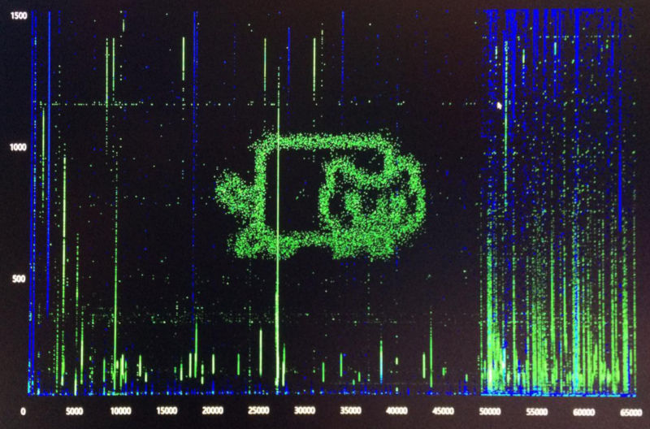

# pimage
Send network packets in a creative way and form images in [port, packetsize]-space

## Note
Only use this software inside your own network and with care.

## Installation

Type the following in command line

    pip install Pillow
    git clone https://github.com/juissi999/pimage.git

## Use

Get an image file you like and send it to host for duration [s].

Type on command line

    python pimage.py [my_imagefile] [host] [duration]
